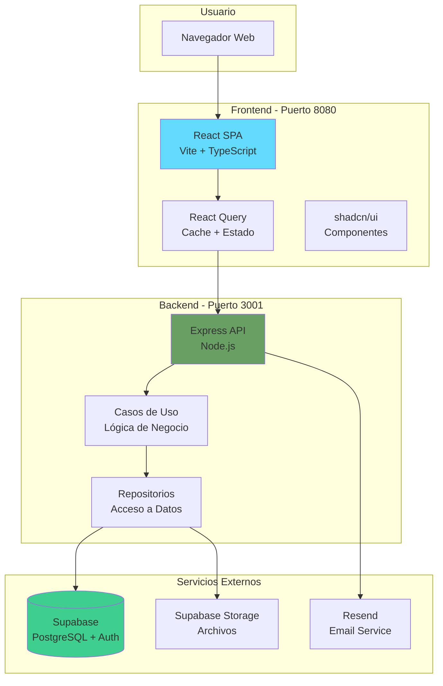
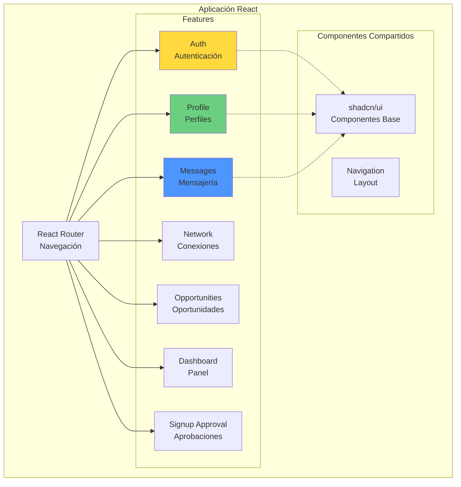
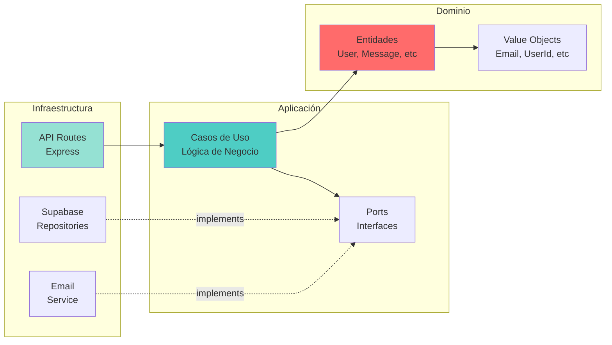
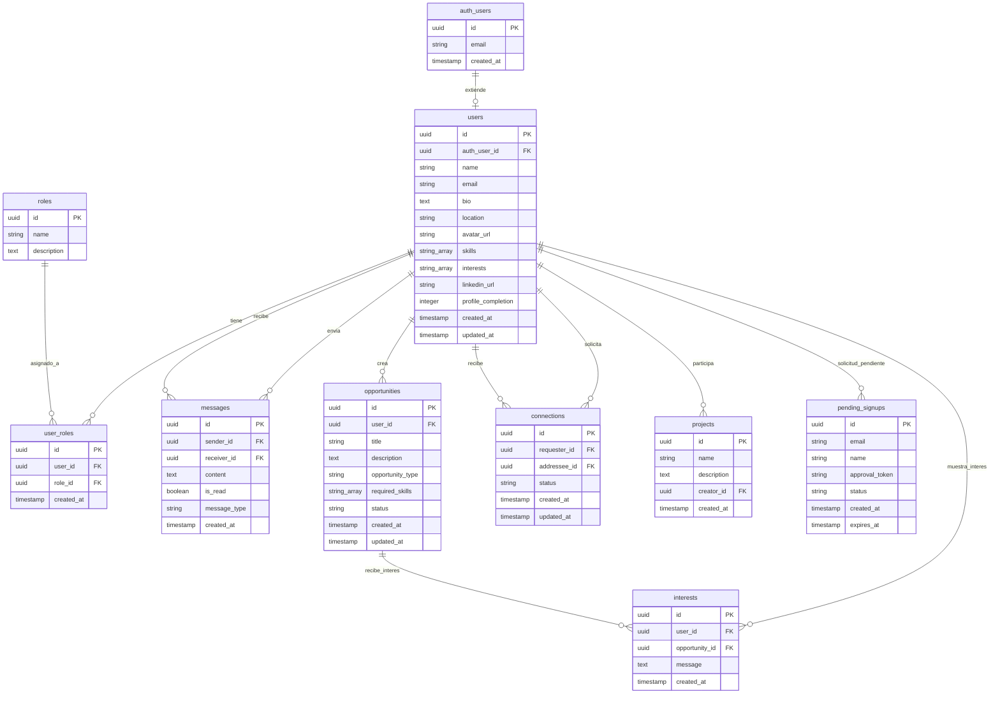
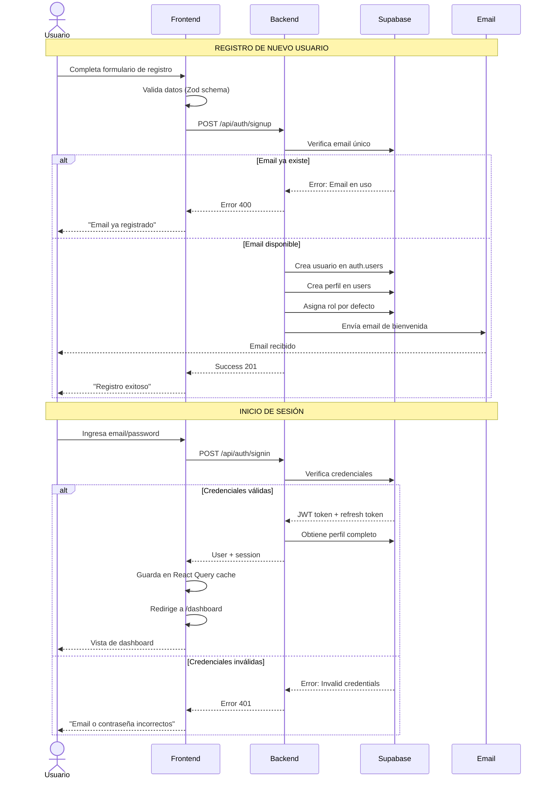
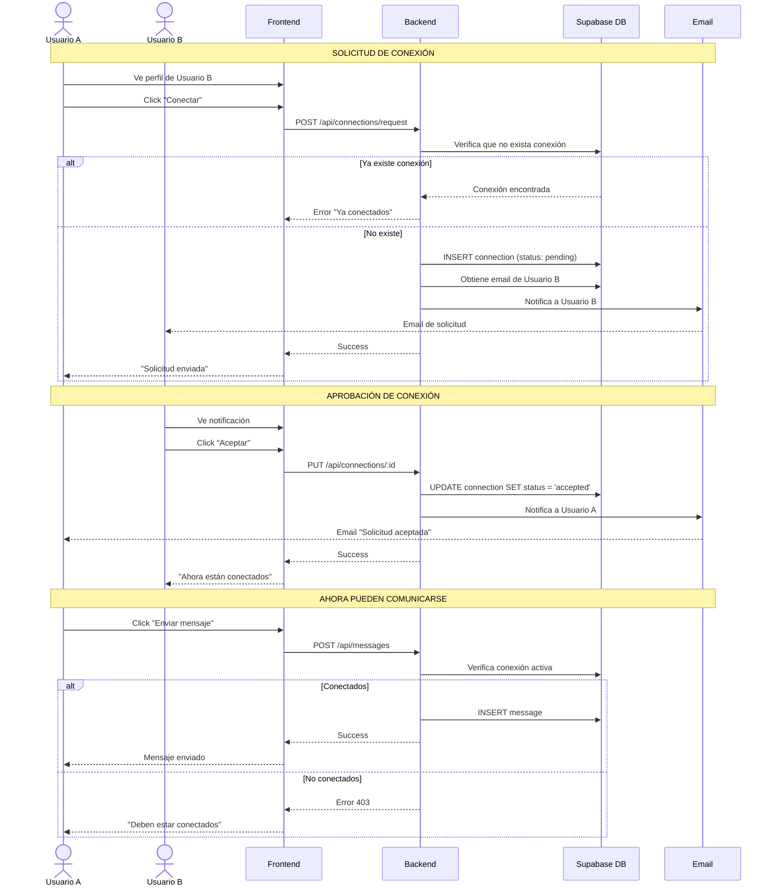
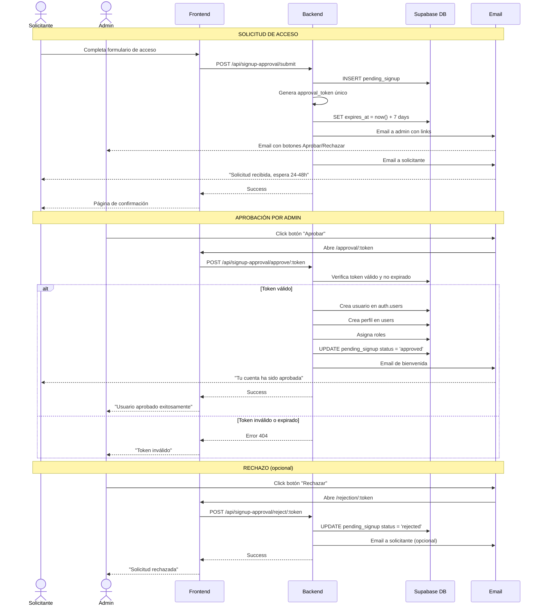

# Diseño Técnico de la Plataforma
# España Creativa Red


**Versión**: 1.0
**Fecha**: Noviembre 2025
**Documento**: Diseño Técnico y Arquitectura del Sistema

---

## Resumen Ejecutivo

**España Creativa Red** es una plataforma web de networking profesional diseñada específicamente para conectar emprendedores y mentores dentro de la comunidad de España Creativa. La plataforma facilita la colaboración, el mentoring y la creación de oportunidades de negocio entre los miembros de la asociación.

### Características Principales

La plataforma ofrece:

- **Networking Profesional**: Sistema de conexiones entre usuarios con solicitudes y aprobaciones
- **Mensajería en Tiempo Real**: Comunicación directa entre miembros conectados
- **Gestión de Oportunidades**: Publicación y búsqueda de oportunidades de colaboración
- **Perfiles Profesionales**: Perfiles detallados con habilidades, intereses y experiencia
- **Sistema de Roles**: Diferenciación entre emprendedores, mentores y administradores
- **Aprobación de Registros**: Control de calidad en el acceso a la plataforma

### Tecnologías Clave

El sistema está construido con tecnologías modernas y escalables:

- **Frontend**: React con Vite para una experiencia de usuario rápida y fluida
- **Backend**: Node.js/Express con arquitectura hexagonal para máxima mantenibilidad
- **Base de Datos**: PostgreSQL (vía Supabase) con seguridad a nivel de fila
- **Autenticación**: Sistema seguro con tokens JWT y persistencia de sesión
- **Email**: Notificaciones automatizadas vía Resend

### Estado del Proyecto

La plataforma está completamente funcional y lista para producción, con:

- 7 módulos principales implementados y probados
- Sistema de seguridad RLS (Row Level Security) completo
- Arquitectura preparada para escalar
- Código limpio y bien documentado

---

## Índice

1. [Visión General de la Plataforma](#1-visión-general-de-la-plataforma)
2. [Arquitectura del Sistema](#2-arquitectura-del-sistema)
3. [Stack Tecnológico](#3-stack-tecnológico)
4. [Modelo de Datos](#4-modelo-de-datos)
5. [Flujos Principales](#5-flujos-principales)
6. [Seguridad y Privacidad](#6-seguridad-y-privacidad)
7. [Deployment e Infraestructura](#7-deployment-e-infraestructura)
8. [Casos de Uso](#8-casos-de-uso)

---

## 1. Visión General de la Plataforma

### 1.1 Propósito

España Creativa Red nace para resolver una necesidad específica: **conectar de manera efectiva a emprendedores con mentores** y facilitar oportunidades de colaboración dentro del ecosistema de España Creativa.

### 1.2 Usuarios Objetivo

La plataforma está diseñada para tres tipos de usuarios:

| Rol | Descripción | Capacidades |
|-----|-------------|-------------|
| **Emprendedor** | Profesionales buscando mentoría y oportunidades | Conectar, buscar mentores, publicar necesidades |
| **Mentor** | Profesionales ofreciendo experiencia y guía | Conectar, ofrecer mentoría, compartir oportunidades |
| **Administrador** | Gestores de la plataforma | Aprobar registros, moderar contenido, gestionar usuarios |

### 1.3 Funcionalidades Principales

#### 🔐 Sistema de Registro y Autenticación
- Registro con aprobación administrativa
- Inicio de sesión seguro con persistencia
- Recuperación de contraseña
- Cierre de sesión con limpieza de sesión

#### 👥 Gestión de Perfiles
- Creación de perfil profesional completo
- Actualización de información personal
- Subida de foto de perfil
- Indicador de completitud del perfil (%)
- Búsqueda de perfiles por habilidades e intereses

#### 🤝 Sistema de Conexiones
- Solicitud de conexión entre usuarios
- Aprobación/rechazo de solicitudes
- Visualización de red de contactos
- Estadísticas de red (conexiones activas, pendientes)
- Visualización de conexiones mutuas

#### 💬 Mensajería
- Chat privado entre usuarios conectados
- Notificaciones de mensajes no leídos
- Historial de conversaciones
- Marcado de mensajes como leídos

#### 🎯 Oportunidades de Colaboración
- Publicación de oportunidades
- Búsqueda y filtrado de oportunidades
- Gestión de oportunidades propias
- Indicación de tipo (proyecto, mentoría, inversión, etc.)

#### 🏠 Dashboard Personalizado
- Vista general de la actividad
- Nuevos miembros de la red
- Mensajes recientes
- Oportunidades destacadas

---

## 2. Arquitectura del Sistema

### 2.1 Arquitectura General

La plataforma sigue una **arquitectura de tres capas separadas** con comunicación clara entre ellas:



### 2.2 Arquitectura Frontend

El frontend está organizado por **features** (módulos funcionales), no por tipo de archivo:



Cada feature contiene:
- **Components**: Componentes visuales (presentación)
- **Hooks**: Lógica de estado y efectos
- **Data/Services**: Comunicación con el backend
- **Data/Schemas**: Validación de datos (Zod)

### 2.3 Arquitectura Backend (Hexagonal)

El backend sigue el patrón de **Arquitectura Hexagonal** (Ports & Adapters):



**Ventajas de esta arquitectura**:
- ✅ Dominio puro sin dependencias externas
- ✅ Fácil testing (mock de interfaces)
- ✅ Intercambio de tecnologías sin afectar lógica
- ✅ Mantenibilidad a largo plazo

---

## 3. Stack Tecnológico

### 3.1 Frontend

| Tecnología | Versión | Propósito |
|------------|---------|-----------|
| **React** | 18.3 | Framework UI principal |
| **Vite** | 6.0 | Build tool y dev server (muy rápido) |
| **TypeScript** | 5.6 | Tipado estático (menos errores) |
| **React Router** | 7.0 | Navegación entre páginas |
| **React Query** | 5.62 | Gestión de estado del servidor (cache inteligente) |
| **Zustand** | 5.0 | Estado global ligero |
| **shadcn/ui** | Latest | Sistema de componentes (basado en Radix UI) |
| **Tailwind CSS** | 3.4 | Estilos utility-first |
| **Zod** | 3.24 | Validación de datos |

**¿Por qué estas tecnologías?**
- **React + Vite**: Desarrollo ultra-rápido, builds optimizados
- **TypeScript**: Detecta errores antes de ejecutar
- **React Query**: Cache automático, sincronización de datos
- **shadcn/ui**: Componentes accesibles y personalizables
- **Tailwind**: Estilos consistentes sin CSS custom

### 3.2 Backend

| Tecnología | Versión | Propósito |
|------------|---------|-----------|
| **Node.js** | 20+ | Runtime de JavaScript |
| **Express** | 4.21 | Framework web minimalista |
| **TypeScript** | 5.6 | Tipado estático en backend |
| **tsx** | 4.19 | Ejecución de TypeScript directa |
| **Vitest** | 3.2 | Testing framework (compatible con Vite) |

### 3.3 Base de Datos y Servicios

| Servicio | Propósito | Características |
|----------|-----------|-----------------|
| **Supabase** | Base de datos + Auth + Storage | PostgreSQL managed, Auth JWT, Storage S3-compatible |
| **PostgreSQL** | 16+ | Base de datos relacional |
| **Resend** | Servicio de email | Templates HTML, alta deliverability |

**¿Por qué Supabase?**
- ✅ PostgreSQL completo (no limitado)
- ✅ Row Level Security (RLS) nativo
- ✅ Autenticación integrada
- ✅ Realtime subscriptions (para mensajería)
- ✅ Storage para archivos (avatares)
- ✅ Generación automática de APIs

---

## 4. Modelo de Datos

### 4.1 Diagrama Entidad-Relación



### 4.2 Descripción de Tablas Principales

#### 👤 **users** (Perfiles de Usuario)
Extiende la tabla `auth.users` de Supabase con información de perfil.

**Campos destacados**:
- `profile_completion`: Calculado automáticamente (0-100%)
- `skills`: Array de habilidades (permite búsqueda avanzada)
- `interests`: Array de intereses profesionales
- `avatar_url`: URL en Supabase Storage

**Trigger automático**: Calcula `profile_completion` en cada update basado en campos completados.

#### 🔑 **user_roles** (Roles de Usuario)
Relación many-to-many entre usuarios y roles.

**Roles disponibles**:
- `emprendedor`: Puede buscar mentores y oportunidades
- `mentor`: Puede ofrecer mentoría
- `admin`: Puede aprobar usuarios y moderar

#### 💬 **messages** (Mensajes)
Mensajes privados entre usuarios.

**Campos destacados**:
- `message_type`: 'private' | 'board' (futuro: mensajes públicos)
- `is_read`: Control de mensajes no leídos
- Índice compuesto en `(sender_id, receiver_id, created_at)`

#### 🤝 **connections** (Conexiones)
Red de contactos entre usuarios.

**Estados posibles**:
- `pending`: Solicitud enviada, esperando respuesta
- `accepted`: Conexión activa
- `rejected`: Solicitud rechazada
- `blocked`: Usuario bloqueado

#### 🎯 **opportunities** (Oportunidades)
Proyectos, mentorías, inversiones publicadas.

**Tipos de oportunidad**:
- `proyecto`: Proyecto colaborativo
- `mentoria`: Búsqueda de mentor/mentee
- `inversion`: Oportunidad de inversión
- `empleo`: Oferta laboral

#### ✅ **pending_signups** (Registros Pendientes)
Nuevos usuarios esperando aprobación administrativa.

**Campos destacados**:
- `approval_token`: Token único para aprobar/rechazar
- `status`: 'pending' | 'approved' | 'rejected'
- `expires_at`: Expira en 7 días si no se aprueba

### 4.3 Índices y Optimizaciones

La base de datos incluye índices estratégicos:

```sql
-- Búsqueda full-text en español
CREATE INDEX idx_users_search ON users
USING gin(to_tsvector('spanish', name || ' ' || COALESCE(bio, '')));

-- Búsqueda por skills (GIN index en arrays)
CREATE INDEX idx_users_skills ON users USING gin(skills);
CREATE INDEX idx_users_interests ON users USING gin(interests);

-- Mensajes por conversación
CREATE INDEX idx_messages_conversation ON messages(sender_id, receiver_id, created_at);

-- Conexiones por usuario
CREATE INDEX idx_connections_user ON connections(requester_id, addressee_id);
```

---

## 5. Flujos Principales

### 5.1 Flujo de Autenticación y Registro



**Características del flujo**:
- ✅ Validación en cliente (UX inmediata)
- ✅ Validación en servidor (seguridad)
- ✅ Creación atómica de usuario + perfil + rol
- ✅ Email automático de bienvenida
- ✅ JWT con auto-refresh (Supabase)
- ✅ Persistencia de sesión en navegador

### 5.2 Flujo de Conexiones entre Usuarios



**Reglas de negocio**:
- ✅ Solo usuarios conectados pueden enviarse mensajes
- ✅ Una solicitud de conexión pendiente bloquea nuevas solicitudes
- ✅ Notificación por email en cada paso
- ✅ Estado bidireccional (A conectado con B = B conectado con A)

### 5.3 Flujo de Aprobación de Registros



**Características del flujo**:
- ✅ Control de calidad en el acceso
- ✅ Tokens únicos de un solo uso
- ✅ Expiración automática (7 días)
- ✅ Notificaciones por email en cada paso
- ✅ Admin puede aprobar/rechazar desde email directamente

---

## 6. Seguridad y Privacidad

### 6.1 Row Level Security (RLS)

Todas las tablas tienen **políticas RLS** habilitadas. Esto significa que la seguridad está a **nivel de base de datos**, no solo en el código:

```sql
-- Ejemplo: Solo el propietario puede actualizar su perfil
CREATE POLICY "Users can update own profile"
ON users FOR UPDATE
USING (auth.uid() = id)
WITH CHECK (auth.uid() = id);

-- Ejemplo: Solo usuarios conectados pueden ver mensajes
CREATE POLICY "Users can read own messages"
ON messages FOR SELECT
USING (
  auth.uid() = sender_id OR
  auth.uid() = receiver_id
);
```

**Ventajas de RLS**:
- ✅ Seguridad a nivel de infraestructura (no bypasseable)
- ✅ Protección automática en todas las queries
- ✅ Funciona incluso si hay bugs en el código

### 6.2 Autenticación

**Mecanismo**: JWT (JSON Web Tokens) gestionados por Supabase

**Flujo de seguridad**:
1. Usuario inicia sesión → Supabase genera JWT
2. JWT incluye claims: `user_id`, `role`, `exp` (expiración)
3. Frontend almacena JWT en localStorage (seguro en modern browsers)
4. Cada request incluye JWT en header `Authorization: Bearer <token>`
5. Backend valida JWT en cada endpoint
6. Tokens expiran automáticamente (1 hora)
7. Refresh token permite renovar sin re-login (7 días)

**Protección contra ataques**:
- ✅ HTTPS obligatorio en producción
- ✅ CORS configurado (solo dominios permitidos)
- ✅ Rate limiting en endpoints sensibles
- ✅ Validación de inputs (Zod schemas)
- ✅ Sanitización de SQL (queries parametrizadas)

### 6.3 Privacidad de Datos

**Datos sensibles protegidos**:
- Emails: Solo visible para el propio usuario
- Mensajes: Solo visible para emisor y receptor
- Conexiones: Estado de conexión privado

**Cumplimiento**:
- ✅ Política de privacidad implementada ([/privacy](src/components/pages/PrivacyPage.tsx))
- ✅ Datos almacenados en servidores EU (Supabase EU region)
- ✅ Sin tracking de terceros
- ✅ Usuario puede eliminar su cuenta (GDPR-ready)

---

## 7. Deployment e Infraestructura

### 7.1 Arquitectura de Deployment

```mermaid
graph TB
    subgraph "CDN + Frontend"
        Vercel[Vercel<br/>Frontend React]
        CDN[CDN Global<br/>Assets estáticos]
    end

    subgraph "Backend API"
        Railway[Railway/Render<br/>Express Server]
    end

    subgraph "Servicios Managed"
        SupaDB[(Supabase<br/>PostgreSQL)]
        SupaAuth[Supabase Auth<br/>JWT]
        SupaStorage[Supabase Storage<br/>S3-compatible]
        ResendAPI[Resend API<br/>Email Service]
    end

    Usuario[Usuario] --> Vercel
    Vercel --> CDN
    Vercel --> Railway
    Railway --> SupaDB
    Railway --> SupaAuth
    Railway --> SupaStorage
    Railway --> ResendAPI

    style Vercel fill:#000
    style Railway fill:#6B46C1
    style SupaDB fill:#3ECF8E
```



### 7.2 Entornos

| Entorno | Frontend | Backend | Base de Datos |
|---------|----------|---------|---------------|
| **Desarrollo** | localhost:8080 (Vite) | localhost:3001 (Express) | Supabase Proyecto Dev |
| **Producción** | Vercel (vercel.app) | Railway/Render | Supabase Proyecto Prod |

### 7.3 Variables de Entorno

**Frontend (.env)**:
```bash
VITE_SUPABASE_URL=https://xxx.supabase.co
VITE_SUPABASE_ANON_KEY=eyJxxx...
```

**Backend (.env)**:
```bash
SUPABASE_SERVICE_ROLE_KEY=eyJxxx...
RESEND_API_KEY=re_xxx...
SUPABASE_DB_CONNECTION_STRING=postgresql://xxx
```

### 7.4 Proceso de Deployment

**Frontend (Vercel)**:
```bash
# Build automático desde git push
git push origin main

# Vercel detecta cambios → Build → Deploy
# Build command: yarn build
# Output: dist/
# ✅ Deploy en ~2 minutos
```

**Backend (Railway/Render)**:
```bash
# Deploy automático desde git push
git push origin main

# Railway detecta cambios → Build → Deploy
# Start command: yarn start
# ✅ Deploy en ~3 minutos
```

**Base de Datos (Supabase)**:
```bash
# Ejecutar migrations via SQL Editor
psql $DATABASE_URL < migrations/xxx.sql

# O usar Supabase CLI
supabase db push
```

### 7.5 Monitoreo y Logs

**Frontend**:
- Vercel Analytics (performance, errores)
- Console logs enviados a backend endpoint `/api/dev/logs`

**Backend**:
- Railway/Render logs nativos
- Structured logging con categorías

**Base de Datos**:
- Supabase Dashboard (queries lentas, uso de disco)
- Alertas automáticas (uso > 80%)

---

## 8. Casos de Uso

### 8.1 Caso de Uso: Emprendedor Busca Mentor

**Actor**: Emprendedor (María)
**Objetivo**: Encontrar un mentor en marketing digital

**Flujo**:

1. **Búsqueda de perfiles**
   - María accede a "Red" → "Buscar miembros"
   - Filtra por:
     - Rol: "Mentor"
     - Skills: ["marketing digital", "redes sociales"]
   - Ve lista de 5 mentores con esas habilidades

2. **Revisión de perfil**
   - Click en perfil de Juan (mentor en marketing)
   - Ve bio, experiencia, skills, LinkedIn
   - Decide conectar

3. **Solicitud de conexión**
   - Click "Conectar"
   - Escribe mensaje: "Hola Juan, me interesa tu experiencia en..."
   - Envía solicitud
   - Juan recibe email de notificación

4. **Aprobación y primer contacto**
   - Juan revisa perfil de María
   - Aprueba la conexión
   - María recibe notificación
   - María envía primer mensaje privado
   - Juan responde → Inician mentoría

**Resultado**: Conexión exitosa, inicio de mentoría

---

### 8.2 Caso de Uso: Mentor Publica Oportunidad

**Actor**: Mentor (Carlos)
**Objetivo**: Encontrar emprendedor para colaborar en proyecto

**Flujo**:

1. **Crear oportunidad**
   - Carlos accede a "Oportunidades" → "Crear"
   - Completa formulario:
     - Título: "Co-founder técnico para startup fintech"
     - Descripción: Detalles del proyecto
     - Tipo: "Proyecto"
     - Skills requeridas: ["React", "Node.js", "Fintech"]
   - Publica

2. **Visibilidad**
   - Oportunidad aparece en listado público
   - Usuarios con skills relevantes la ven destacada
   - 3 emprendedores muestran interés

3. **Gestión de interesados**
   - Carlos recibe notificaciones
   - Revisa perfiles de interesados
   - Inicia conversaciones con 2 candidatos
   - Selecciona co-founder después de videollamadas

**Resultado**: Proyecto inicia con co-founder encontrado en la plataforma

---

### 8.3 Caso de Uso: Admin Aprueba Registro

**Actor**: Administrador (Laura)
**Objetivo**: Aprobar nuevo miembro de España Creativa

**Flujo**:

1. **Solicitud recibida**
   - Laura recibe email:
     > "Nueva solicitud de acceso: Pedro González"
     > Email: pedro@example.com
     > Razón: "Emprendedor en sector turismo sostenible"

2. **Revisión**
   - Laura verifica que Pedro es miembro de España Creativa
   - Revisa LinkedIn (incluido en solicitud)
   - Decide aprobar

3. **Aprobación**
   - Click botón "Aprobar" en el email
   - O accede a panel de admin → "Solicitudes Pendientes"
   - Click "Aprobar" en solicitud de Pedro
   - Confirma

4. **Creación de cuenta**
   - Sistema crea usuario automáticamente
   - Asigna rol "Emprendedor"
   - Envía email a Pedro con credenciales de acceso
   - Pedro recibe: "Tu cuenta ha sido aprobada. Accede aquí."

5. **Primer acceso de Pedro**
   - Pedro inicia sesión
   - Completa su perfil (bio, skills, foto)
   - Empieza a buscar mentores

**Resultado**: Nuevo miembro activo en la plataforma

---

### 8.4 Caso de Uso: Networking en Evento

**Actor**: Varios emprendedores y mentores
**Contexto**: Evento presencial de España Creativa

**Flujo**:

1. **Durante el evento**
   - Emprendedores y mentores se conocen en persona
   - Intercambian nombres y deciden conectar en la plataforma

2. **Conexiones post-evento**
   - Ana busca a Luis en la plataforma
   - Envía solicitud: "Fue un placer conocerte en el evento de ayer"
   - Luis aprueba
   - Ana y Luis ahora pueden chatear

3. **Seguimiento**
   - Luis envía a Ana un mensaje:
     > "Hola Ana, me comentaste sobre tu proyecto de ecommerce.
     > Te comparto esta oportunidad que acabo de publicar..."
   - Luis comparte link de oportunidad
   - Ana muestra interés
   - Coordinan reunión vía chat privado

**Resultado**: Evento presencial + plataforma = networking efectivo

---

## Conclusión

España Creativa Red es una plataforma robusta, escalable y segura que facilita el networking profesional dentro de la comunidad de España Creativa.

### Características Técnicas Destacadas

✅ **Arquitectura moderna y mantenible**
- Frontend basado en features (modular)
- Backend hexagonal (fácil evolución)
- Separación clara de responsabilidades

✅ **Seguridad implementada a nivel de infraestructura**
- Row Level Security en base de datos
- JWT con auto-refresh
- Validación en cliente y servidor

✅ **Escalabilidad**
- Arquitectura stateless (backend)
- Cache inteligente (React Query)
- Base de datos managed (Supabase)
- CDN global (Vercel)

✅ **Experiencia de usuario optimizada**
- SPA rápida (Vite)
- Navegación fluida (React Router)
- UI accesible (shadcn/ui)
- Feedback inmediato (validación en tiempo real)

### Estado Actual

La plataforma está **100% funcional** y lista para ser utilizada en producción por la comunidad de España Creativa.

---

**Documento preparado para**: Cliente España Creativa
**Versión**: 1.0
**Fecha**: Noviembre 2025
